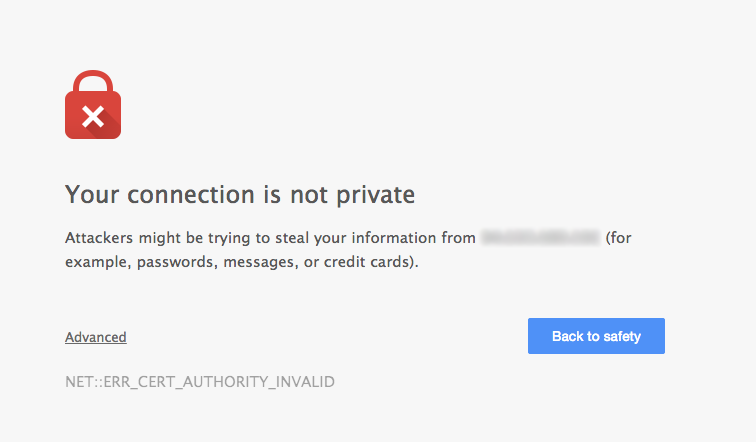

# SSL Certificate Chain Resolver
[](https://travis-ci.org/freekmurze/ssl-certificate-chain-resolver)
[](https://insight.sensiolabs.com/projects/2912a3ab-51a8-4e07-9bad-fd94a833f989)
[](https://packagist.org/packages/spatie/ssl-certificate-chain-resolver)
[](https://packagist.org/packages/spatie/ssl-certificate-chain-resolver)

CA's (*certificate authorities*) don't use their root certificate to sign customer certificates, they use something called intermediate certificates.

Some clients *(like mobile browsers and OpenSSL)* still dont support the AIA extension for downloading these intermediate certificates.
This results in an incomplete certificate chain.


And gives you 'untrusted'-warnings like this, since the browser thinks you are on an insecure connection.



<b>ssl-certificate-chain-resolver</b> downloads these intermediate certificates for you.

### But what does it actually do?

If the, for example, mobile browser you are using doesn't support the AIA extension, your certificate will look something like this:

```
-----BEGIN CERTIFICATE-----
MIIDITCCAoqgAwIBAgIQT52W2WawmStUwpV8tBV9TTANBgkqhkiG9w0BAQUFADBM
...
IOkKcGQRCMha8X2e7GmlpdWC1ycenlbN0nbVeSv3JUMcafC4+Q==
-----END CERTIFICATE-----
```

When the resolver completes this chain it will look like:

```
-----BEGIN CERTIFICATE-----
MIIDITCCAoqgAwIBAgIQT52W2WawmStUwpV8tBV9TTANBgkqhkiG9w0BAQUFADBM
...
IOkKcGQRCMha8X2e7GmlpdWC1ycenlbN0nbVeSv3JUMcafC4+Q==
-----END CERTIFICATE-----
-----BEGIN CERTIFICATE-----
MIIDIzCCAoygAwIBAgIEMAAABjANBgkqhkiG9w0BAQUFADBfMQswCQYDVQQGEwJV
...
sszLbNlOp++qVkPi4iKjgGiwg6piNBGT4BAfgSGZIi4bosoz9Qlh
-----END CERTIFICATE-----
```

The necessary intermediate certificates will be added to the chain and the connection will be viewed as secure!

## Installation

The <b>ssl-certificate-chain-resolver</b> can be installed using Composer by running this command.

```
    composer global require spatie/ssl-certificate-chain-resolver
```

Simple as that!

## Usage

The resolver has one required argument, <b>the certificate that needs to be resolved.</b>

And one optional argument, <b>what the resolved certificate should be saved as.</b>

So, the resolver can be started with the command:

```
    ssl-certificate-chain-resolver certificate.crt
```

*Where certificate.crt is the certificate that needs to be resolved.*

And if you choose to use the optional argument:

```
    ssl-certificate-chain-resolver certificate.crt resolved.crt
```

If the optional argument is not specified, the resolved certificate will be saved as <b>trustChain.crt</b> .

### Example

I have an incomplete certificate file called <b>cert.crt</b>, I want to complete it and save it as <b>completeCert.crt</b> in a map called <b>foo</b>.
The command for this is:

```
ssl-certificate-chain-resolver cert.crt foo/completeCert.crt
```

The magic happens and the certificate is complete and ready to use!

## Updating

You can update <b>ssl-certificate-chain-resolver</b> to the latest version by running:

```
    composer global update spatie/ssl-certificate-chain-resolver
```

## Testing

ssl-certificate-chain-resolver uses <b>Codeception</b> for testing.
Both functional-and unit-testing are currently being used.

The functional test [CertificateCept.php](tests/functional/CertificateCept.php) simply checks if the command is able to fire and if the returned file has the correct contents.

The unit test [CertificateTest.php](test/unit/CertificateTest.php) checks if the resolver correctly fetches the content of the original certificate and if the correct values are extracted, *parentCertificate, issuer DN and parent URL*.


