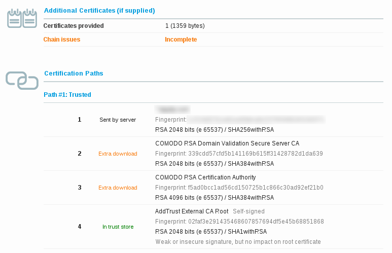

# SSL Certificate Chain Resolver
[](https://travis-ci.org/freekmurze/ssl-certificate-chain-resolver)
[](https://insight.sensiolabs.com/projects/2912a3ab-51a8-4e07-9bad-fd94a833f989)[](https://packagist.org/packages/spatie/ssl-certificate-chain-resolver)[](https://packagist.org/packages/spatie/ssl-certificate-chain-resolver)

This tool can help you fix the [incomplete certificate chain issue](#background-the-trust-chain), also reported as *Extra download* by [Qualys SSL Server Test](https://www.ssllabs.com/ssltest/).

## Installation

This package can be installed using composer by running this command.

```bash
    composer global require spatie/ssl-certificate-chain-resolver
```

## Usage

Let's assume you have an incomplete certificate  called ```cert.crt```. To generate the a file containing the certificate and the entire trust chain, you can use this command:

```bash
ssl-certificate-chain-resolver cert.crt
```

A file containing the certificate and the entire trust chain will be saved as ```certificate-including-trust-chain.crt```

You can also pass the name of the file of the outputfile as the second argument:
```bash
ssl-certificate-chain-resolver cert.crt your-output-file.crt
```

## Updating

You can update <b>ssl-certificate-chain-resolver</b> to the latest version by running:

```bash
    composer global update spatie/ssl-certificate-chain-resolver
```

## Tests

Functional and unit tests are included with the package.

You can run them yourself with ```vendor/bin/codecept run```

## Background: the trust chain

All operating systems contain a set of default trusted root certificates. But Certificate Authorities usually don't use their root certificate to sign customer certificates. Instead of they use so called intermediate certificates, because they can be rotated more frequently.

A certificate can contain a special Authority Information Access extension (RFC-3280) with URL to issuer's certificate. Most browsers can use the AIA extension to download missing intermediate certificate to complete the certificate chain. This is the exact meaning of the Extra download message. But some clients, mostly mobile browsers, don't support this extension, so they report such certificate as untrusted.




It also gives you 'untrusted'-warnings like this, since the browser thinks you are on an insecure connection.


A server should always send a complete chain, which means concatenated all certificates from the certificate to the trusted root certificate (exclusive, in this order), to prevent such issues.  So when installing a SSL certificate on a server you should install all intermediate certificates as wel. You should be able to fetch intermediate certificates from the issuer and concat them together by yourself.

This tool helps you automatize that boring task by looping over certificate's AIA extension field.


